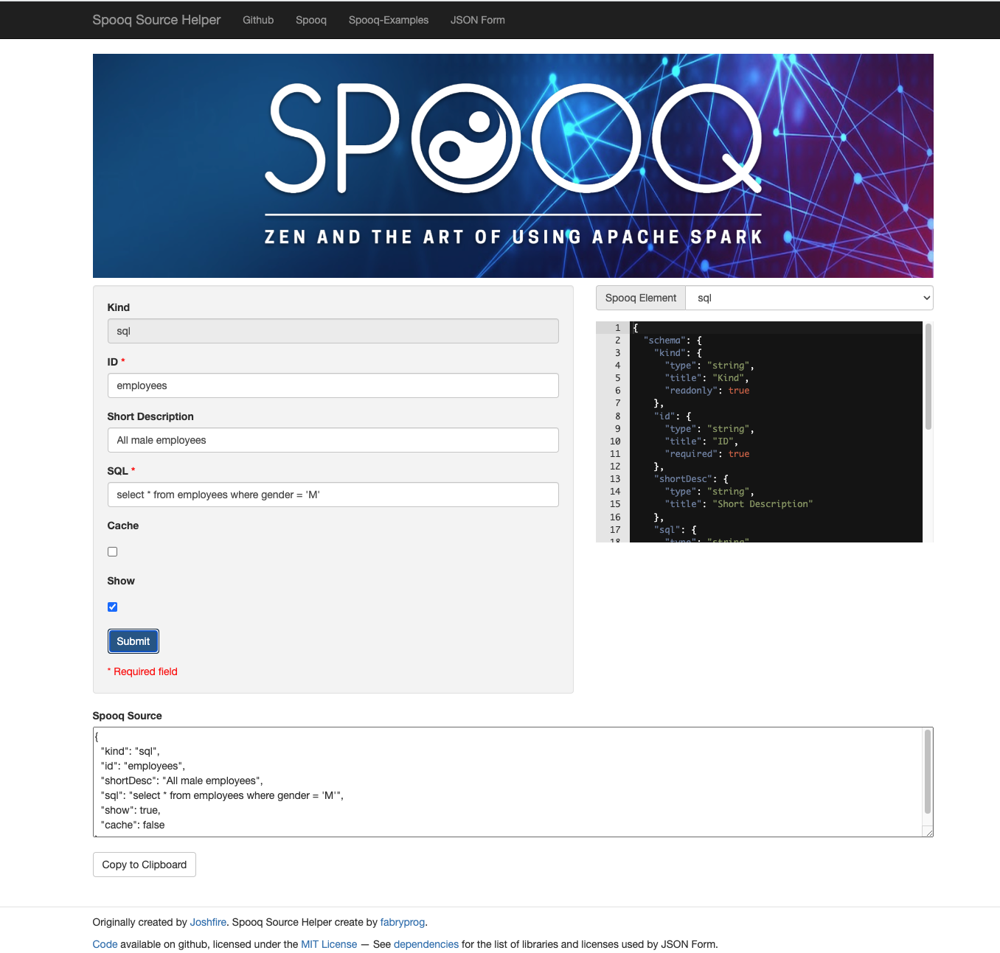

SPOOQ Source Helper 
=========

Powered from "json form playground" demo project.

This one-page application will help the user to create [Spooq](https://github.com/supermariolabs/spooq) sources file

The project must be served over HTTP. There are many ways you can achieve that. Here are two:

1. Using Python's `SimpleHTTPServer`
```bash
python -m SimpleHTTPServer
```
Then open this page in your favorite browser:
[`http://localhost:8000/playground/`](http://localhost:8000/playground/)

2. Using `http-server` node module
```bash
npm install -g http-server
http-server
```
Then open this in page in your favorite browser:
[`http://localhost:8080/playground/`](http://localhost:8080/playground/)

NB: The final `/` in the URL is needed.

## Preview


